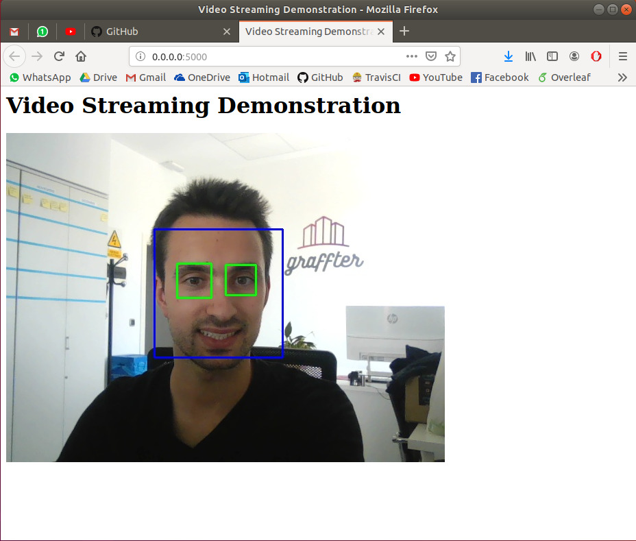

# flask-streaming-faces
This repository contains an example of hot to detect faces in a remote we server


## Install
Just ensure that you are using the Python 3.X version and install the requirements:

```
pip install -r requirements.txt
```

## Usage
Run the server with:
```
python3 server.py
```

You should see something like:
```
python /home/iago/workspace/flask-streaming-faces/server.py
 * Serving Flask app "server" (lazy loading)
 * Environment: production
   WARNING: This is a development server. Do not use it in a production deployment.
   Use a production WSGI server instead.
 * Debug mode: off
 * Running on http://0.0.0.0:5000/ (Press CTRL+C to quit)
127.0.0.1 - - [20/Jun/2019 17:41:00] "GET / HTTP/1.1" 200 -
```

And visit with your favourite browser the url ` http://0.0.0.0:5000/`:



